<!-- ============ HEADER BANNER ============ -->
<div align="center">




<br><br>

<a href="https://www.linkedin.com/in/jeevaneshwaran-g-a05863315"></a>
<a href="mailto:gmjeeva05@gmail.com"></a>
<a href="https://github.com/Jeeva1415?tab=repositories"></a>

<br>


</div>

<br>

## 🧑‍💻 About Me

> 🎓 **B.Sc. Computer Science with Artificial Intelligence & Data Science**

I love working with data: finding patterns, building clear visualizations, and turning models into practical apps that solve real problems.

|  |  |
|---|---|
| 🔭 **Currently working on** | Data Analytics dashboards & ML web apps |
| 🌱 **Currently learning** | SQL • Power BI • Deep Learning with Keras |
| 🎯 **Focus** | Data Analytics • Python • Machine Learning |
| 💬 **Ask me about** | Pandas, Streamlit, Flask, Scikit-learn |
| ⚡ **Fun fact** | I learn best by building something real |

```text
 📊 Data Analysis  ─▶  🐍 Python & SQL  ─▶  📈 Visualization  ─▶  🤖 Machine Learning  ─▶  🚀 Real-World Solutions
```

<br>

## 🛠️ Tech Stack

<div align="center">

**💻 Languages**


**📊 Data & Analytics**


**🤖 AI & Machine Learning**


**🌐 Apps & Tools**


</div>

<br>

## 🚀 Featured Projects

<div align="center">

<table>
<tr>
<td width="50%" valign="top">

### 🧠 [Stress Detection AI](https://github.com/Jeeva1415/YOUR_REPO)
Classifies stress levels from smartphone sensor and lifestyle patterns.

`Low` • `Medium` • `High`


</td>
<td width="50%" valign="top">

### 🎓 [Student Performance Prediction](https://github.com/Jeeva1415/YOUR_REPO)
Web app that predicts student performance from academic and behavioral features.


</td>
</tr>
<tr>
<td width="50%" valign="top">

### 📈 [Digital Marketing Analytics](https://github.com/Jeeva1415/YOUR_REPO)
Interactive dashboard for exploring marketing data and business insights.


</td>
<td width="50%" valign="top">

### 🎬 [Netflix Data Analysis](https://github.com/Jeeva1415/YOUR_REPO)
Exploratory analysis of Netflix content to uncover trends and patterns.


</td>
</tr>
</table>

</div>

<br>

## 📊 GitHub Activity

<div align="center">


<br>


</div>

<br>

## 📚 Certifications & Learning

<div align="center">

| Area | Course / Focus |
| :--: | :-- |
| 🐍 | **Data Science with Python** |
| 📊 | **Power BI** |
| 🤖 | **Supervised Learning** |
| ❄️ | **Snowflake Data Modeling** |
| 🧠 | **Deep Learning with Keras** |
| ☁️ | **Salesforce Innovator** |

</div>

<br>

## 🧭 My Approach

<div align="center">

**Learn** ➜ **Build** ➜ **Analyze** ➜ **Improve** ➜ **Share**

*The best way to learn technology is to build practical projects and keep improving on real problems.*

</div>

<br>

## 🤝 Let's Connect

<div align="center">

I'm open to data analytics opportunities, collaborations, and interesting projects.

<a href="https://www.linkedin.com/in/jeevaneshwaran-g-a05863315"></a>
<a href="mailto:gmjeeva05@gmail.com"></a>


</div>
